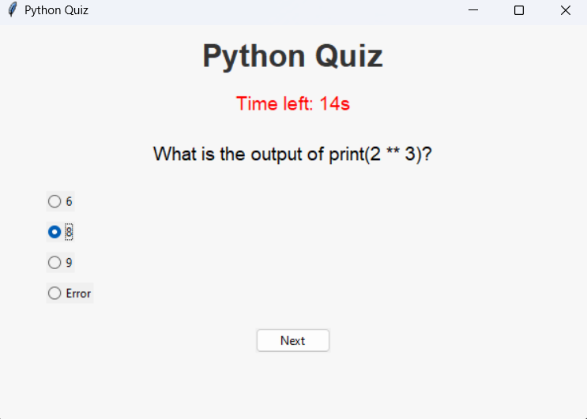

 <h1>Python Quiz Application</h1>
    
This is a simple Python-based quiz application built using the <strong>Tkinter</strong> library for creating graphical user interfaces (GUIs). The application tests users' knowledge of Python through multiple-choice questions with a timer for each question.

    
<h2>Features</h2>
    <ul>
        <li><strong>Multiple Choice Questions:</strong> Each question has four options, and the user selects one using radio buttons.</li>
        <li><strong>Timer:</strong> A 30-second countdown timer for each question keeps the quiz engaging and time-bound.</li>
        <li><strong>Scoring System:</strong> Tracks the user's score based on correct answers.</li>
        <li><strong>Result Display:</strong> Shows the final score upon quiz completion.</li>
        <li><strong>User-Friendly Interface:</strong> Clean design with an intuitive layout.</li>
    </ul>
  
    
     
<h2>How to Use</h2>
    <ol>
        <li><strong>Start the Quiz:</strong> Run the code to launch the application. The first question will display along with four options.</li>
        <li><strong>Select an Answer:</strong> Choose an answer by clicking the corresponding radio button.</li>
        <li><strong>Submit Answer:</strong> Click the <em>"Next"</em> button to move to the next question.</li>
        <li><strong>Timer:</strong> Answer before the timer runs out, or the quiz automatically progresses to the next question.</li>
        <li><strong>End of Quiz:</strong> Once all questions are answered, a message box will display your final score.</li>
    </ol>
    

This application is great for beginners to practice Python concepts or test their knowledge interactively.

